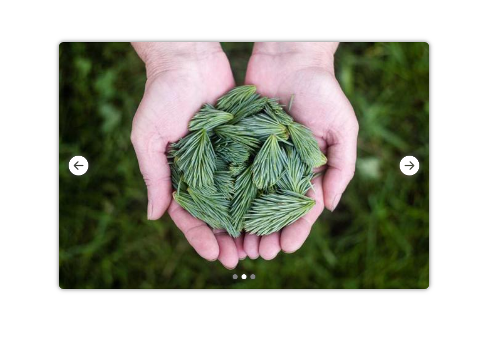

## Image Carousel

A simple Image carousel component

## Getting Started

1. **Clone the Repository**: Get a local copy of the repository by running:
   ```bash
   git clone https://github.com/haxor2411/react-carousel.git

2. **Install dependencies**: Run Command:
   ```bash
   npm install
3. **Run Server** :
   ```bash
   npm start  


## Screenshot

<div align="center">
  <br><br>
</div>